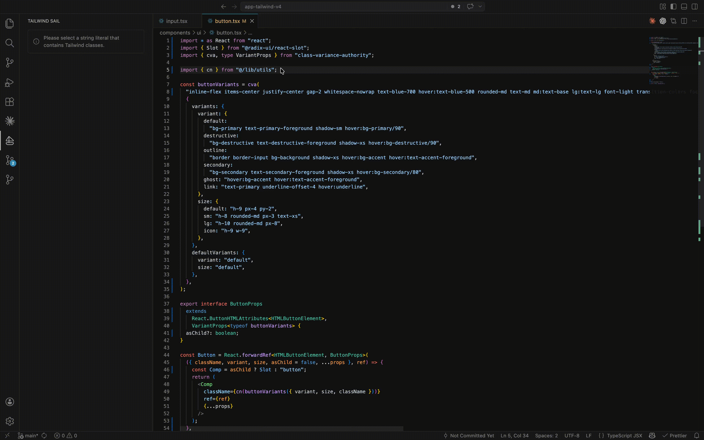

# Tailwind Sail

**Tailwind Sail** gives you a panel next to your current file that displays long Tailwind class strings in a much more accessible way. You can filter them by utility, state, or breakpoint to see which styles are applied for specific variants. You can even add new classes directly from the panel.

No more headaches when editing long Tailwind class strings — Tailwind Sail brings back the overview you need to create beautiful interfaces that AI can only dream about.

Demo in higher quality: [MP4](https://github.com/fritzbenning/tailwind-sail/blob/main/assets/tailwind-sail-demo.mp4) · [WebM](https://github.com/fritzbenning/tailwind-sail/blob/main/assets/tailwind-sail-demo.webm).

## Commands

| Command | Description |
|--------|-------------|
| **Tailwind Sail: Show Sidebar** | Focuses the secondary side bar and opens the Tailwind Sail view. |
| **Tailwind Sail: Refresh** | Immediately re-runs extraction and parsing for the current editor. |
| **Tailwind Sail: Set Sidebar Horizontal Padding…** | Chooses **compact** or **loose** horizontal inset for the sidebar (updates `tailwind-sail.layout`). |
| **Tailwind Sail: Set Sidebar Top Padding…** | Chooses **compact** or **loose** top padding for the sidebar (updates `tailwind-sail.paddingTop`). |
| **Tailwind Sail: Toggle Sidebar Right Border** | Turns the sidebar webview’s optional right border on or off (updates `tailwind-sail.showSidebarRightBorder`). |

## Settings

| Setting | Default | Description |
|--------|---------|-------------|
| `tailwind-sail.updateDebounceMs` | `20` | Milliseconds to wait after cursor or document changes before Tailwind Sail re-runs string detection and Tailwind parsing. |
| `tailwind-sail.highlightActiveString` | `true` | Underline the string literal Tailwind Sail is currently using. |
| `tailwind-sail.layout` | `loose` | Horizontal inset: **`loose`** (roomier) or **`compact`** (tighter). |
| `tailwind-sail.paddingTop` | `compact` | Top padding above content: **`loose`** (roomier) or **`compact`** (tighter). |
| `tailwind-sail.showSidebarRightBorder` | `false` | When **true**, draws a 1px right border on the sidebar panel. Default **off** in VS Code; enable in hosts like **Cursor** if you want a visible separator next to the editor. |

See [CONTRIBUTING.md](CONTRIBUTING.md) to build from source or contribute.

## License

Tailwind Sail is released under the [MIT License](LICENSE).

