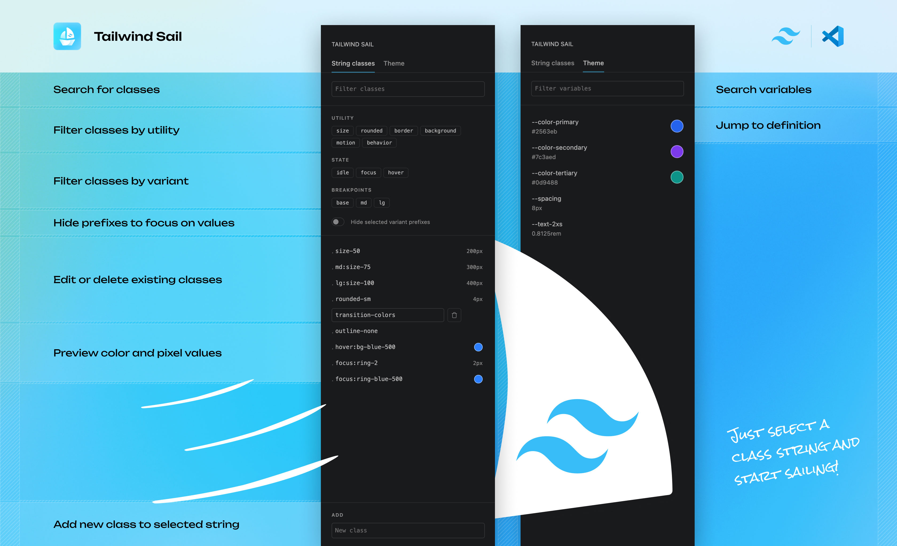

# Tailwind Sail

**Tailwind Sail** is a quite powerful sidebar panel that displays the content of Tailwind class strings in a much more accessible way. 

## Features

- Filter classes by utility, state or breakpoint
- Support for class strings and @apply
- Preview color and pixel values
- Edit or delete classes directly
- Hide variant prefixes to focus on class values
- Add Tailwind v4 theme files to preview custom colors and overrides

I really appreciate your feedback. Just drop a [github issue](https://github.com/fritzbenning/tailwind-sail/issues) or send me a [dm](https://x.com/fritzbenning). And if you're really enjoying it, it would be awesome if you consider to leave a star for the [github repo](https://github.com/fritzbenning/tailwind-sail).

## Add theme files

To show previews for your own palette, spacing, and other theme values, point Tailwind Sail at the CSS file(s) where you define Tailwind v4 theme custom properties.

1. Open your theme file in the editor (it must be a `.css` file inside the workspace).
2. Run **Tailwind Sail: Add Current File to Theme Files** from the Command Palette, or set the `tailwind-sail.variables.sourceFiles` array in Settings to one or more workspace-relative paths, for example `src/app/globals.css`.

## Layout settings

Since VS Code and some third-party forks, such as Cursor, handle layouts slightly differently, Tailwind Sail provides consistent layout settings to improve the visual fit. You can adjust the sidebar padding, borders, and the spacing between the panel title and the extension content to match your preferences.

You can find the available settings and commands in the Features tab. 

## Support

If you find Tailwind Sail useful, you can [buy me a coffee](https://buymeacoffee.com/friddle) to help maintain the extension and fund new features. 

## License

Tailwind Sail is released under the [MIT License](LICENSE).

